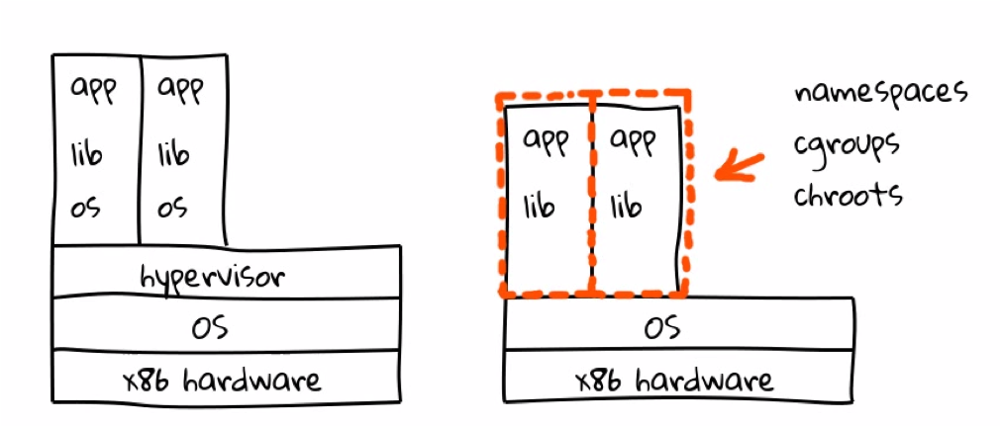

## Bienvenido a workshop Docker 101

En este escenario vamos a tener un primer acercamiento a los containers, discutiendo sobre sus ventajas y desafíos. Tambien empezaremos a trabajar con Docker y Podman como containers Engine.  

* Introducción a los Containers
    * Que son los containers?
    * Que es Docker?
    * Primeros pasos con Docker

### Que es un container?

Un container se define como un proceso que corre aislado de otros procesos (u otros containers) en el sistema, compartiendo su entorno de ejecución. A bajo nivel, un container es creado usando algunos features del KERNEL que permite lograr este control y aislamiento.  
 * cgroups (controlgroups): Permite limitar un proceso en el uso de recursos de cómputo (entre otras cosas).
 * namespaces: Permite ejecutar un proceso en un entorno de sandbox
 * chroot: Un container usa una estrategia similar (aunque mas avanzada) a chroot para lograr aislamiento a nivel del file system.

 

 A diferencia de una VM, un container solo contiene lo necesario e indispensable para ejecutar la aplicación, esto es, el runtime y las libs necesarias para ejecutar dicha aplicación, el resto de las dependencias son "heredadas" desde el sistema operativo que lo contiene. Gracias a esto, los containers ofrecen facilidades en la portabilidad, gestión del ciclo de vida y delivery de la aplicación.

### Que es Docker?

Docker es entre otras cosas, un container Engine. Docker proveé las herramientas necesarias para desarrollar, empaquetar y entregar aplicaciones en containers de forma fácil y separada de la infraestructura debajo para que esta entrega de aplicaciones sea lo mas fluida posible.

#### Componentes de Docker

