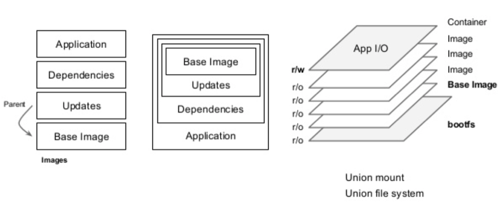
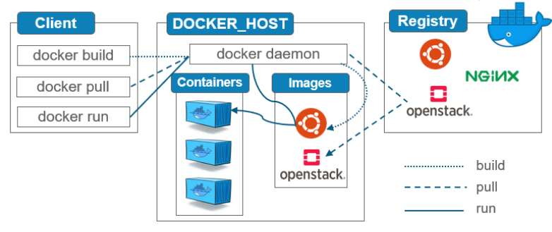
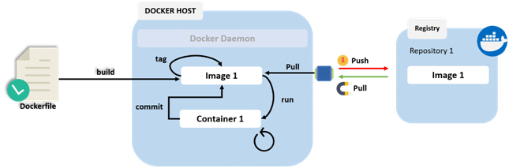

### Qué es una imagen?

Un "container image" o simplemente Image, es un paquete ejecutable que contiene lo necesario para correr una aplicación, típicamente, el código, el runtime con sus librerías y configuraciones específicas. Una imagen es usada para instanciar un container a partir de ella y gracias a su estructura, es posible modificar sin necesidad de re-empaquetar todo el contenido, dado a que una imagen esta compuesta por varias layers y cada una de estas capas representa un repositorio, donde solo necesitamos modificar el contenido específico de esa layer sin alterar el resto.  



Cuando ejecutamos el comando `docker run hello-world` del paso previo, invocamos al cliente de Docker y le dimos la instrucción de instanciar un container a partir de la imagen `hello-world` la cual, al no existir localmente, la fue a buscar a un Registro de Imágenes o Registry. (tal como se mostraba en el imagen de arquitectura)  




### Crear una imagen

Existen varias formas de armar imágenes propias, incluso algunas ya vienen embebidas con el setup de Docker. Por ejemplo:  
* Dockerfile (buildkit)
* Compose  

Vamos a crear una imagen a partir de un archivo de manifiesto llamado Dockerfile. El proceso se explica con detalle en el workflow siguiente:  



Para esto, les facilitamos una aplicación escrita en node.js:  

`git clone https://github.com/mauricioamendola/app-netlabs-ocp.git`{{execute}}

`cd app-netlabs-ocp`{{execute}}  

Crear un archivo de nombre Dockerfile con el siguiente contenido:  
```yaml
FROM node:15.12.0-slim
COPY . /usr/src/app
WORKDIR /usr/src/app
RUN npm install
EXPOSE 8080
ENTRYPOINT ["node", "index.js"]
```
Para crearlo automaticamente pueden ejecutar el comando de abajo:  

```cat <<EOF > Dockerfile
FROM node:15.12.0-slim
COPY . /usr/src/app
WORKDIR /usr/src/app
RUN npm install
EXPOSE 8080
ENTRYPOINT ["node", "index.js"]
EOF
```{{execute}}

Construir la imagen usando `docker build`:    

`docker build -t nodejs-app:v1 .`{{execute}}  

Vayamos por partes:  


 * FROM: Indica la imagen base sobre la que se construirá la aplicación dentro del contenedor. En este caso: `FROM node:15.12.0-slim`
 * COPY: Copia archivos a un destino específico dentro del contenedor, normalmente se utiliza el . para especificar que copie todo lo que está en el directorio del Dockerfile. En este caso: `COPY . /usr/src/app`
 * WORKDIR: Indica el path dentro del contenedor donde se va a trabajar. En este caso: `WORKDIR /usr/src/app`
 * RUN: Ejecuta uno o varios comandos dentro del contenedor en el momento del build. En este caso: `RUN npm install`
 * EXPOSE: Informa en qué puerto el proceso que se levanta está escuchando, es a modo de documentación. En este caso: `EXPOSE 8080`
 * ENTRYPOINT: Define una serie de comandos que solo se ejecutarán una vez que el contenedor se ha inicializado, pueden ser comandos Shell con parámetros establecidos. En este caso: `ENTRYPOINT ["node", "index.js"]`

Podemos comprobar la imagen creada usando el comando `docker images`  
`docker images`{{execute}}