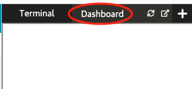

Como habíamos comentado, un container es una instancia en tiempo de ejecución de una imagen, por lo que para crear uno basta con ejecutar el comando referenciando a la imagen que queremos usar.  

Instanciar el container con `docker run`  usando la imagen creada en el paso anterior `nodejs-app:v1`:  

`docker run -d -p 8080:8080 nodejs-app:v1`{{execute}}

Vamos por parte:

* docker run es el comando para correr un comando
* Con -d le indicamos que queremos que corra en `detached mode`
* Con -p le indicamos con qué puerto queremos publicar el servicio que corre dentro del container. Es un mapeo que hacemos en el host con el formato hostPort:containerPort
* nodejs-app:v1 es la imagen:tag que usamos como base para el container

Podemos comprobar la ejecución del container con el comando `docker ps`  

`docer ps`{{execute}}

En el panel de "Dashboard" se puede consultar la web de la aplicación.  
