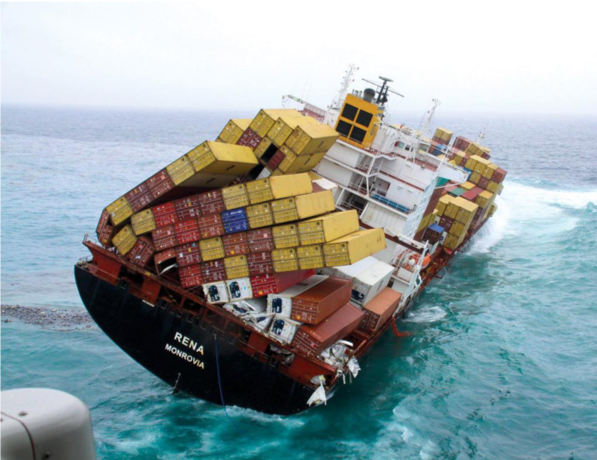

### The container Mess

  

Usar un Container Engine como Docker o Podman puede ser suficiente si tenemos pocos containers. Cuando las aplicaciones empiezan a crecer y las instancias se densifican, debemos de empezar a evaluar si estamos o no ante la necesidad de un Orquestador de Containers.   
Que señales o indicadores debemos de tener en consideración? Aquí algunos...  

* Necesitamos escalar horizontal o verticalmente a decenas o centenas de Containers.
* Necesitamos gestionar en que host ejecutar el container.
* Necesitamos distribuír las instancias de un mismo componente de forma inteligente.
* Necesitamos gestionar el lifecycle del container.
* Necesitamos garantizar que la aplicación no se se "caerá".
* Etc.  

Si algunas de estas señales se transforman en necesidades, debemos de evaluar la implementación de un orquestador de Containers.  

### Kubernetes (a.k.a k8s)

TO-DO: Explicar que es Kubernetes  

#### Principios de Diseño

* Distribuído: el mejor fit para aplicaciones cloud nativas.
* Desacoplado: Se abstrae del hardware donde se ejecuta y provee de interfaces (APIs) para el acceso a los recursos
* Declarativo: Fuertemente apoyado en la idea de declarar el estado deseado de la plataforma y de los objetos que en ella se ejecuta.
* Soporte para la inmutabilidad de la infraestructura

#### Conceptos básicos

Para hablar de Kubernetes tenemos que mencionar algunos de los principales conceptos que lo componen, como lo son los llamados "Objetos":  

* PODs
* ReplicationController / ReplicaSet
* Deployments
* Services
* Namespaces
* IngressController

