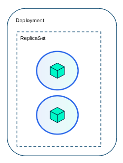

Cuando en el paso anterior creamos el POD con la herramienta `kubectl` pasándole entre otros, el parámetro `--restart=Never` estamos indicando que _solo_ vamos a crear un POD y nada mas. Esto implica que si eliminamos dicho POD, Kubernetes eliminará el POD junto con sus containers y por ende, el proceso de la aplicación. Entonces de qué forma podemos garantizar de que la aplicación no se va a caer? O dicho de otra forma, si el POD se elimina o se corrompe, de qué forma podemos volver a levantarla?  

Por supuesto que si ejecutamos nuevamente el comando ejecutado en el paso anterior vamos a instanciar nuevamente la aplicación, pero hay otros objetos que nos automatizan el despliegue de la app de forma automática, pudiendo ademas controlar el ciclo de vida de la misma.  

Para esto tenemos los llamados _**ReplicationControllers**_ /  _**ReplicaSets**_ y _**Deployments**_.  

### ReplicationController / ReplicaSet

Estos objetos gestionan la cantidad de réplicas de una aplicación, es decir, la cantidad de PODs que queremos en un determinado momento para un POD. Gracias a este objeto podemos instanciar mas de un POD y garantizar el número de réplicas deseadas.  
Ambos objetos cumplen la misma función, aunque el _**ReplicaSet**_ sucede al _**ReplicationController**_.  

### Deployments

Con los _**Deployments**_ agregamos una capa de abstracción donde podemos gestionar la forma en que vamos a reemplazar el POD ante un cambio en la imagen, es decir, de qué forma vamos a gestionar las actualizaciones. Los _**Deployments**_ manejan automáticamente los _**ReplicaSet**_, es por esto que es recomendable crear _**Deployments**_ en lugar de _**ReplicaSet**_ solamente.  

  


Para crear un **Deployment** basta con ejecutar el comando `kubectl run webapp --image=some_image`  

`kubectl run webapp --image=httpd:2.4`{{execute}}  

¿Y si queremos crear con más de una réplica?  

Basta con agregar `--replicas=N` al comando anterior.  

`kubectl run web-app --image=httpd:2.4 --replicas=2`{{execute}}  

También podemos crear el **Deployment** usando un manifiesto en formato YAML.  

Antes de continuar, vamos a limpiar los deployments anteriores.  

`kubectl delete deployment webapp`{{execute}}  
`kubectl delete deployment web-app`{{execute}}  

Crear un archivo de nombre `webapp-deployment.yaml`  

```
cat <<EOF > webapp-deployment.yaml
apiVersion: apps/v1
kind: Deployment
metadata:
  creationTimestamp: null
  labels:
    app: webapp
  name: webapp
spec:
  replicas: 1
  selector:
    matchLabels:
      app: webapp
  strategy: {}
  template:
    metadata:
      creationTimestamp: null
      labels:
        app: webapp
    spec:
      containers:
      - image: httpd:2.4
        name: httpd
        ports: 
        - name: http
          containerPort: 80    
EOF
```{{execute}}  

`kubectl create -f webapp-deployment.yaml`{{execute}}  

Podemos verificar la creación de los nuevos pods con el comando `kubectl get pods`{{execute}}  

Parámetros interesantes a tener en cuenta:  

* revisionHistoryLimit: Controla la cantidad de `ReplicaSet` anteriores dejaremos para ejecutar rollbacks. Por omisión se conservan 10 versiones.    
* strategy: Le indicamos la estrategia de actualización del Deployment. Por omisión es `RollingUpdate`. Otra opción podría ser `Recreate`.  
* replicas: La cantidad de PODs que queremos levantar.  

### Clean up

`kubectl delete -f webapp-deployment.yaml`{{execute}}  
