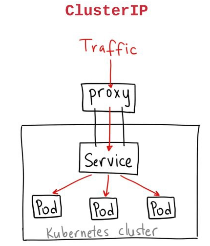
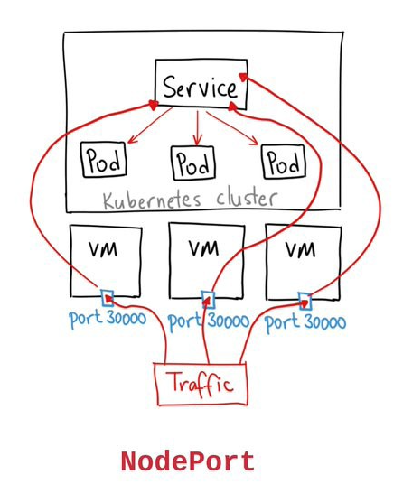
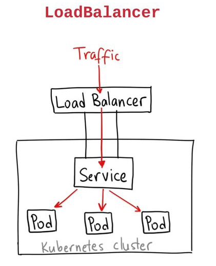

### Services

Los **Services** son una abstracción que nos permiten publicar las aplicaciones para ser consumidas, ya sea por otros PODs o usuarios.  
Existen cuatro tipo de **Services**  

* ClusterIP   
* NodePort  
* LoadBalancer  
* ExternalName  

#### ClusterIP

Se le asigna una IP virtual que puede ser consumida por otras aplicaciones dentro del cluster (tráfico este-oeste) o desde fuera del cluster (norte-sur) usando `kubectl proxy`.  

  
#### NodePort

Sirve para exponer un puerto al exterior. Por omisión, el puerto se asigna de forma Random entre el bloque 30000 y 40000.  

  
#### LoadBalancer

En los servicios de Cloud Pública, este tipo de **Service** se integra con los servicios de balanceadores de carga para publicar directamente un Service mediante una URL ó IP pública.  

  

#### Creando Services

Para crear un **Service** podemos hacerlo mediante comandos usando _kubectl_ o un manifiesto en formato YAML (o JSON).  

`kubectl expose deployment webapp --port=80 --target-port=80 --type=ClusterIP`{{execute}}  

Donde:  
* --port: es el puerto publicado a nivel del cluster  
* --target-port: es el puerto publicado dentro del container  
* --type: es el Service type (ClusterIP | NodePort | LoadBalancer)  

Para crear el **Service** mediante su manifiesto, basta con crear un archivo con el siguiente contenido:  

```
cat <<EOF > webapp-service.yaml
apiVersion: v1
kind: Service
metadata:
  labels:
    app: webapp
  name: webapp
spec:
  ports:
  - port: 80
    protocol: TCP
    targetPort: 80
  selector:
    app: webapp
  type: ClusterIP
EOF
```{{execute}}  

Luego de tener el archivo, podemos crear el Service con el comando `kubectl create -f webapp-service.yaml`  

### Clean up

`kubectl delete svc webapp`{{execute}}